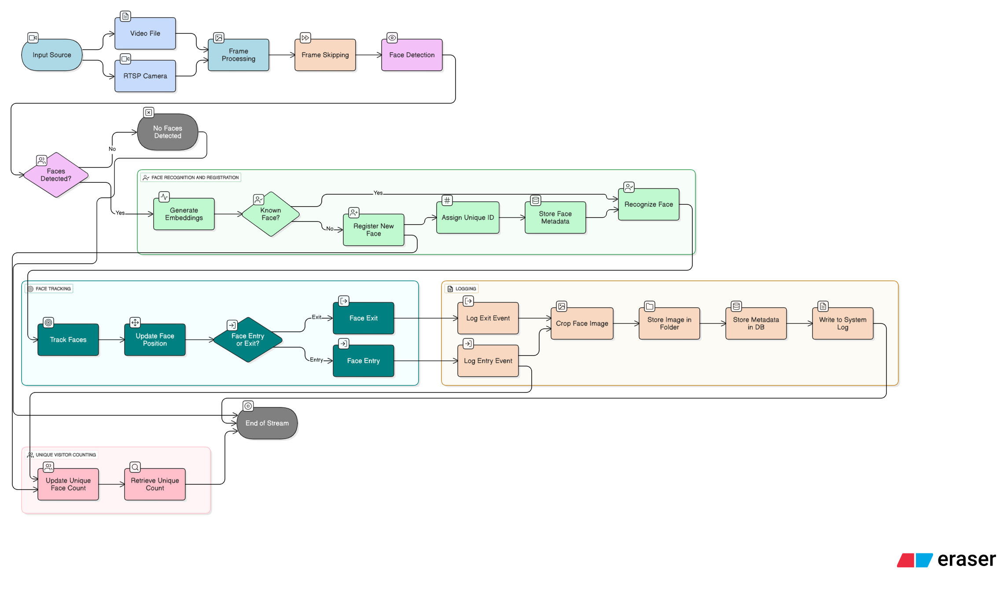

# 🧠 Intelligent Face Tracker with Auto-Registration and Visitor Counting

This is an AI-powered real-time face detection and visitor logging system built with:

* 🔍 YOLOv8 for **face detection**
* 🧬 InsightFace for **face recognition**
* 🚀 DeepSort for **tracking**
* 📍 SQLite for logging and visitor database
* 📹 Supports both **video files** and **live RTSP/camera feeds**

---

## 🔧 Features

* ✅ Detects and recognizes **unique visitors**
* ✅ Auto-registers **new faces** on first appearance
* ✅ Tracks entry/exit per face
* ✅ Logs cropped images with **timestamp**
* ✅ Maintains visitor info in **SQLite DB**
* ✅ Supports real-time stream + video file input
* ✅ Frame-skipping configurable to enhance performance

---

## 🧱 Project Structure

```
├── config.json               # Configuration (video/camera, thresholds)
├── main.py                   # Main tracker script
├── database/
│   └── db.py                 # Visitor DB setup and logging
├── face_detection/
│   └── yolo_detector.py      # YOLOv8 face detector wrapper
├── face_recognition/
│   └── insight_embedder.py   # InsightFace embedding
├── logging_system/
│   └── logger.py             # Logs events (entry/exit)
├── utils/
│   └── helpers.py            # Cosine similarity util
├── logs/                     # Cropped face images
├── yolov8n.pt                # YOLOv8 model weights
└── README.md                 # This file
```

---

## 📊 Architecture



> *Ensure `diagram.png` is placed in your root directory or update the path accordingly.*

---

## 🧪 Setup Instructions

### 1️⃣ Clone the Repo

```bash
git clone https://github.com/SudarrshanaLoganathan/intelligent-face-tracker.git
cd intelligent-face-tracker
```

### 2️⃣ Create and Activate Virtual Environment (Recommended)

```bash
python -m venv venv
venv\Scripts\activate         # For Windows
# OR
source venv/bin/activate     # For Linux/Mac
```

### 3️⃣ Install Dependencies

```bash
pip install -r requirements.txt
```

### 4️⃣ Run the Application

```bash
python main.py
```

---

## 🖊️ Output

* Logs folder containing:

  * `entries/` and `exits/` subfolders
  * Cropped images of detected faces
* SQLite database in `/database/face_log.db`

  * `visitors_YYYY_MM_DD` table for daily visitors
  * `events_YYYY_MM_DD` table for all events

---

## 🌀 Demo Video

Watch the project demonstration on Loom:
[🔗 Watch Now](https://www.loom.com/share/e9ffd0de0ac048fda01ee9bcb60ebeba)

---

## 🙏 Credits

Developed by Sudarrshana Loganathan for Katomaran Hackathon 2025 ✨
